```python
import pandas as pd
import numpy as np
import matplotlib.pyplot as plt
%matplotlib inline

import warnings
warnings.filterwarnings('ignore')
```


```python
google = pd.read_csv("GOOG.csv", index_col='date')[::-1]
apple = pd.read_csv("AAPL.csv", index_col="date")[::-1]
amazon = pd.read_csv("AMZN.csv", index_col="date")[::-1]
microsoft = pd.read_csv("MSFT.csv", index_col="date")[::-1]
walmart = pd.read_csv("Walmart.csv", index_col="date")[::-1]
```


```python
walmart.drop(walmart.index[-1], inplace=True)

```


```python
walmart['volume'] = [np.float(each) for each in walmart['volume']]
```

## 5 year stock price 


```python
google["close"].plot(figsize=(16,8), label="Google", title="5 years Close Price")
apple["close"].plot(label="Apple")
amazon["close"].plot(label="Amazon")
microsoft["close"].plot(label="Microsoft")
walmart["close"].plot(label="Walmart")
plt.legend()
```


    <matplotlib.legend.Legend at 0x7ff475e8b048>


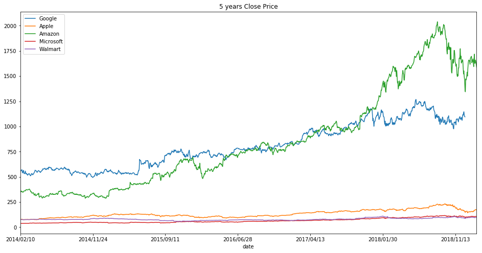


## 5 Year trade volume


```python
google["volume"].plot(figsize=(16,8), label="Google", title="5 years Volume")
apple["volume"].plot(label="Apple")
amazon["volume"].plot(label="Amazon")
microsoft["volume"].plot(label="Microsoft")
walmart['volume'].plot(label="Walmart")
plt.legend()
```


    <matplotlib.legend.Legend at 0x7ff4759677f0>


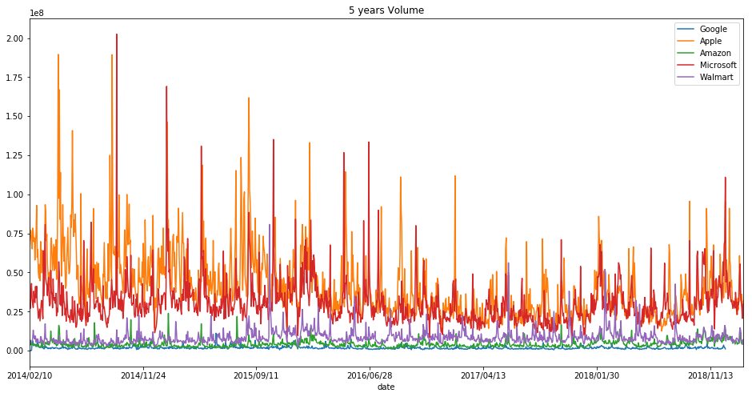


```python
# What happened????
microsoft['volume'].argmax()
```


    '2014/09/19'


```python
# What happened????
apple['volume'].argmax()
```


    '2014/04/24'


## Total Trade Volume in 5 years


```python
google["Total Trade"] = google["open"]*google["volume"]
amazon["Total Trade"] = amazon["open"]*amazon["volume"]
apple["Total Trade"] = apple["open"]*apple["volume"]
microsoft["Total Trade"] = microsoft["open"]*microsoft["volume"]
walmart["Total Trade"] = walmart["open"]*walmart['volume']
```


```python
google["Total Trade"].plot(figsize=(16,8), label="Google", title="5 years Total Traded")
apple["Total Trade"].plot(label="Apple")
amazon["Total Trade"].plot(label="Amazon")
microsoft["Total Trade"].plot(label="Microsoft")
walmart["Total Trade"].plot(label="Walmart")
plt.legend()
```


    <matplotlib.legend.Legend at 0x7ff475617358>


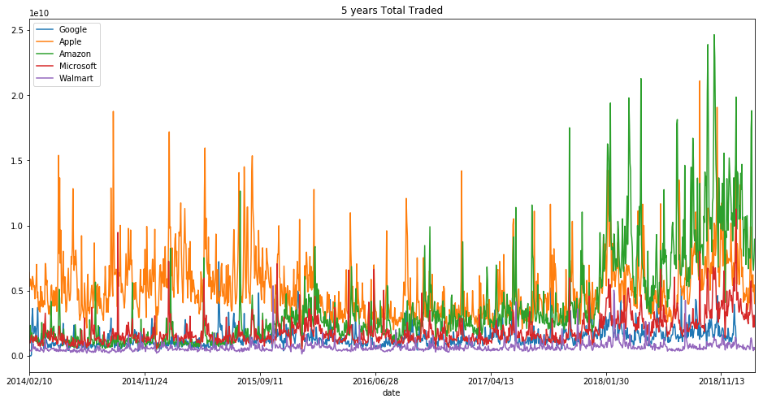


```python
# What happened????
amazon["Total Trade"].argmax()
```


    '2018/10/26'


## Trends

### GOOGLE


```python
google["MA50"] = google["close"].rolling(50).mean()
google["MA200"] = google["close"].rolling(200).mean()
google[["close","MA50", "MA200"]].plot(figsize=(16,8))
```


    <matplotlib.axes._subplots.AxesSubplot at 0x7fc5e6cecf60>


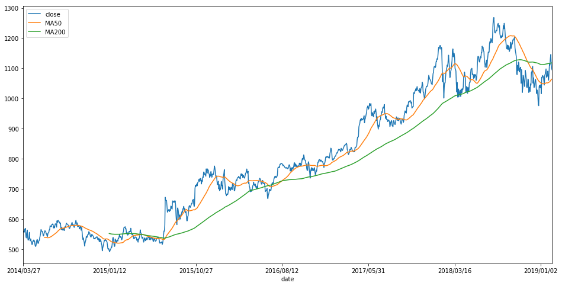


### APPLE


```python
apple["MA50"] = apple["close"].rolling(50).mean()
apple["MA200"] = apple["close"].rolling(200).mean()
apple[["close","MA50", "MA200"]].plot(figsize=(16,8))
```


    <matplotlib.axes._subplots.AxesSubplot at 0x7fc5e6cec780>


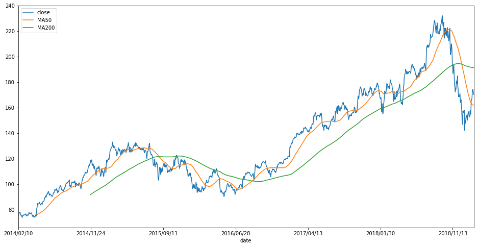


### AMAZON


```python
amazon["MA50"] = amazon["close"].rolling(50).mean()
amazon["MA200"] = amazon["close"].rolling(200).mean()
amazon[["close","MA50", "MA200"]].plot(figsize=(16,8))
```


    <matplotlib.axes._subplots.AxesSubplot at 0x7fc5e7373390>


### MICROSOFT


```python
microsoft["MA50"] = microsoft["close"].rolling(50).mean()
microsoft["MA200"] = microsoft["close"].rolling(200).mean()
microsoft[["close","MA50", "MA200"]].plot(figsize=(16,8))
```


    <matplotlib.axes._subplots.AxesSubplot at 0x7fc5e6c5e198>


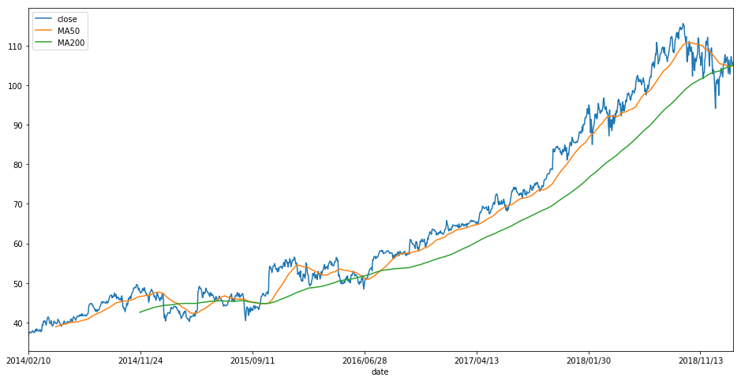


### WALMART


```python
walmart["MA50"] = walmart["close"].rolling(50).mean()
walmart["MA200"] = walmart["close"].rolling(200).mean()
walmart[["close","MA50", "MA200"]].plot(figsize=(16,8))
```


    <matplotlib.axes._subplots.AxesSubplot at 0x7ff479fac5c0>


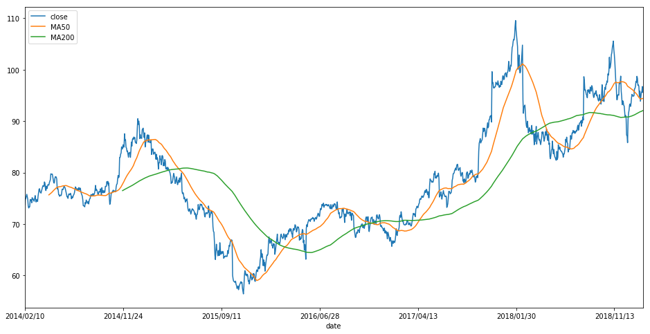


## Correlations


```python
from pandas.plotting import scatter_matrix

all_company = pd.concat([google["close"],amazon['close'],apple['close'], microsoft['close'], walmart['close']], axis=1)
all_company.columns=["Google","Amazon","Apple","Microsoft","Walmart"]
```


```python
scatter_matrix(all_company, figsize=(10,10), alpha= 0.2, hist_kwds={'bins':50})
plt.show()
```


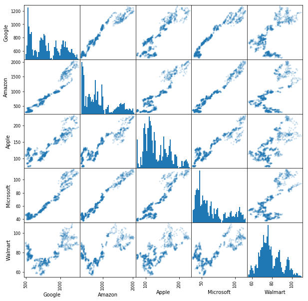


## Candle stick Charts
**It doesn't look good on a candle chart if we put too many dates, so we will take the most recent ones**


```python
from mpl_finance import candlestick_ochl
from matplotlib.dates import DateFormatter, date2num, WeekdayLocator, DayLocator, MONDAY
from datetime import datetime
```


```python
# Get new dataframe for Jan 2019
google_jan_2019 = google.iloc[-30:-1]
# date2num(datetime.strptime(google_jan_2019.index[1], "%Y/%m/%d"))
date_for_convert = [datetime.strptime(each,"%Y/%m/%d") for each in google_jan_2019.index]
google_jan_2019["date_axes"] = [date2num(each) for each in date_for_convert]
gg_jan_values = [tuple(vals) for vals in google_jan_2019[['date_axes','open','close','high','low']].values]

mondays = WeekdayLocator(MONDAY)
alldays = DayLocator()
weekFormatter = DateFormatter('%b %d')
dayFormatter = DateFormatter("%d")

fig, ax = plt.subplots(figsize=(16,8))
fig.subplots_adjust(bottom = 0.2)
ax.xaxis.set_major_locator(mondays)
ax.xaxis.set_minor_locator(alldays)
ax.xaxis.set_major_formatter(weekFormatter)

candlestick_ochl(ax, gg_jan_values, width=0.6, colorup='g', colordown='r')
plt.show()
```


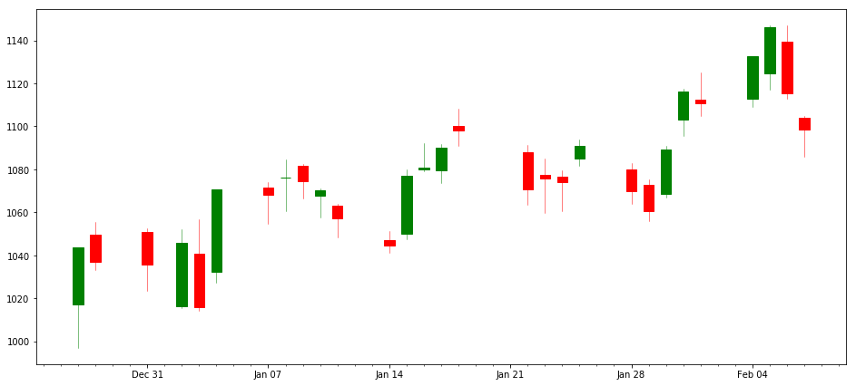


```python
# Get new dataframe for Jan 2019
amazon_jan_2019 = amazon.iloc[-30:-1]
# date2num(datetime.strptime(google_jan_2019.index[1], "%Y/%m/%d"))
date_for_convert_amz = [datetime.strptime(each,"%Y/%m/%d") for each in amazon_jan_2019.index]
amazon_jan_2019["date_axes"] = [date2num(each) for each in date_for_convert_amz]
amazon_jan_values = [tuple(vals) for vals in amazon_jan_2019[['date_axes','open','close','high','low']].values]

mondays = WeekdayLocator(MONDAY)
alldays = DayLocator()
weekFormatter = DateFormatter('%b %d')
dayFormatter = DateFormatter("%d")

fig_amazon, ax_amazon = plt.subplots(figsize=(16,8))
fig_amazon.subplots_adjust(bottom = 0.2)
ax_amazon.xaxis.set_major_locator(mondays)
ax_amazon.xaxis.set_minor_locator(alldays)
ax_amazon.xaxis.set_major_formatter(weekFormatter)

candlestick_ochl(ax_amazon, amazon_jan_values, width=0.6, colorup='g', colordown='r')
plt.show()
```


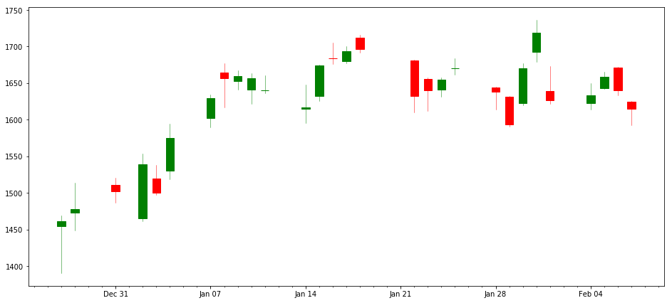


```python
# Get new dataframe for Jan 2019
apple_jan_2019 = apple.iloc[-30:-1]
# date2num(datetime.strptime(google_jan_2019.index[1], "%Y/%m/%d"))
date_for_convert_app = [datetime.strptime(each,"%Y/%m/%d") for each in apple_jan_2019.index]
apple_jan_2019["date_axes"] = [date2num(each) for each in date_for_convert_app]
app_jan_values = [tuple(vals) for vals in apple_jan_2019[['date_axes','open','close','high','low']].values]

mondays = WeekdayLocator(MONDAY)
alldays = DayLocator()
weekFormatter = DateFormatter('%b %d')
dayFormatter = DateFormatter("%d")

fig_app, ax_app = plt.subplots(figsize=(16,8))
fig_app.subplots_adjust(bottom = 0.2)
ax_app.xaxis.set_major_locator(mondays)
ax_app.xaxis.set_minor_locator(alldays)
ax_app.xaxis.set_major_formatter(weekFormatter)

candlestick_ochl(ax_app, app_jan_values, width=0.6, colorup='g', colordown='r')
plt.show()
```


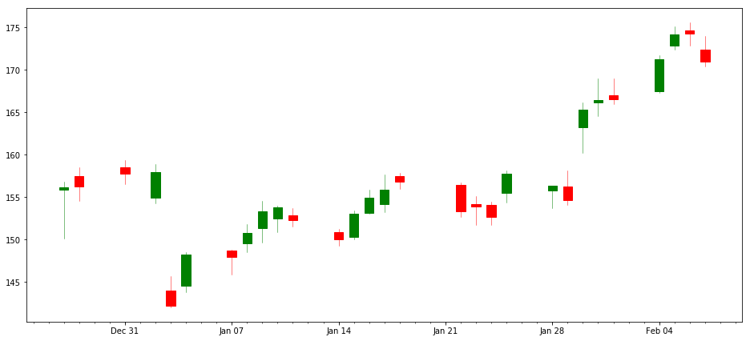


```python
# Get new dataframe for Jan 2019
msft_jan_2019 = microsoft.iloc[-30:-1]
# date2num(datetime.strptime(google_jan_2019.index[1], "%Y/%m/%d"))
date_for_convert_msft = [datetime.strptime(each,"%Y/%m/%d") for each in msft_jan_2019.index]
msft_jan_2019["date_axes"] = [date2num(each) for each in date_for_convert_msft]
msft_jan_values = [tuple(vals) for vals in msft_jan_2019[['date_axes','open','close','high','low']].values]

mondays = WeekdayLocator(MONDAY)
alldays = DayLocator()
weekFormatter = DateFormatter('%b %d')
dayFormatter = DateFormatter("%d")

fig_msft, ax_msft = plt.subplots(figsize=(16,8))
fig_msft.subplots_adjust(bottom = 0.2)
ax_msft.xaxis.set_major_locator(mondays)
ax_msft.xaxis.set_minor_locator(alldays)
ax_msft.xaxis.set_major_formatter(weekFormatter)

candlestick_ochl(ax_msft, msft_jan_values, width=0.6, colorup='g', colordown='r')
plt.show()
```


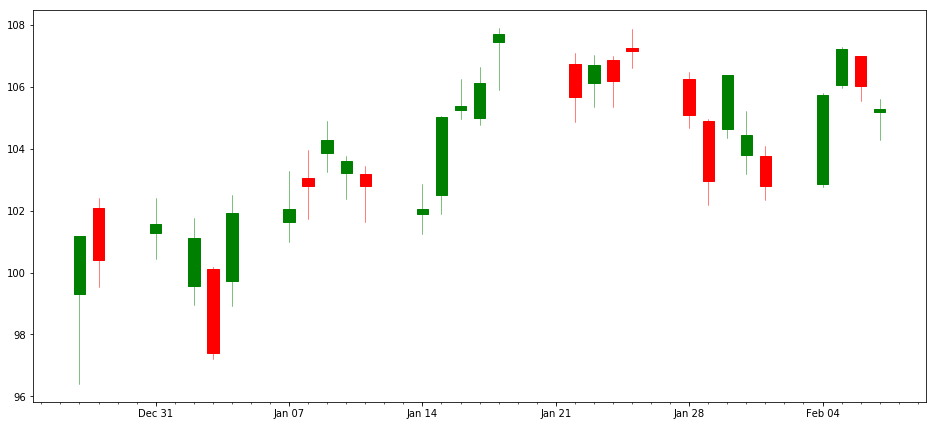


```python
# Get new dataframe for Jan 2019
walmart_jan_2019 = walmart.iloc[-30:-1]
# date2num(datetime.strptime(google_jan_2019.index[1], "%Y/%m/%d"))
date_for_convert_walmart = [datetime.strptime(each,"%Y/%m/%d") for each in walmart_jan_2019.index]
walmart_jan_2019["date_axes"] = [date2num(each) for each in date_for_convert_walmart]
walmart_jan_values = [tuple(vals) for vals in walmart_jan_2019[['date_axes','open','close','high','low']].values]

mondays = WeekdayLocator(MONDAY)
alldays = DayLocator()
weekFormatter = DateFormatter('%b %d')
dayFormatter = DateFormatter("%d")

fig_walmart, ax_walmart = plt.subplots(figsize=(16,8))
fig_walmart.subplots_adjust(bottom = 0.2)
ax_walmart.xaxis.set_major_locator(mondays)
ax_walmart.xaxis.set_minor_locator(alldays)
ax_walmart.xaxis.set_major_formatter(weekFormatter)

candlestick_ochl(ax_walmart, walmart_jan_values, width=0.6, colorup='g', colordown='r')
plt.show()
```


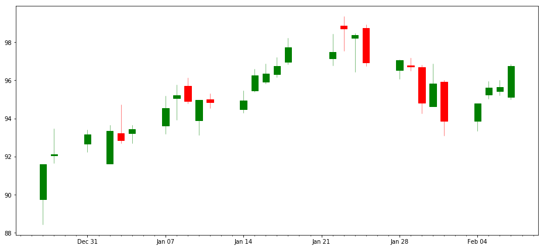


# Basic Financial Analysis

## Daily Percentage Change

$ r_t = \frac{p_t}{p_{t-1}} -1$


```python
google['daily returns'] = (google['close']/google['close'].shift(1))-1
amazon['daily returns'] = (amazon['close']/amazon['close'].shift(1))-1
apple['daily returns'] = (apple['close']/apple['close'].shift(1))-1
microsoft['daily returns'] = (microsoft['close']/microsoft['close'].shift(1))-1
walmart['daily returns'] = (walmart['close']/walmart['close'].shift(1))-1
```


```python
microsoft.head()
```


<div>
<style scoped>
    .dataframe tbody tr th:only-of-type {
        vertical-align: middle;
    }

    .dataframe tbody tr th {
        vertical-align: top;
    }

    .dataframe thead th {
        text-align: right;
    }
</style>
<table border="1" class="dataframe">
  <thead>
    <tr style="text-align: right;">
      <th></th>
      <th>close</th>
      <th>volume</th>
      <th>open</th>
      <th>high</th>
      <th>low</th>
      <th>Total Trade</th>
      <th>daily returns</th>
    </tr>
    <tr>
      <th>date</th>
      <th></th>
      <th></th>
      <th></th>
      <th></th>
      <th></th>
      <th></th>
      <th></th>
    </tr>
  </thead>
  <tbody>
    <tr>
      <th>2014/02/10</th>
      <td>36.800</td>
      <td>26735870.0</td>
      <td>36.63</td>
      <td>36.80</td>
      <td>36.29</td>
      <td>9.793349e+08</td>
      <td>NaN</td>
    </tr>
    <tr>
      <th>2014/02/11</th>
      <td>37.175</td>
      <td>32133250.0</td>
      <td>36.88</td>
      <td>37.26</td>
      <td>36.86</td>
      <td>1.185074e+09</td>
      <td>0.010190</td>
    </tr>
    <tr>
      <th>2014/02/12</th>
      <td>37.470</td>
      <td>27051620.0</td>
      <td>37.35</td>
      <td>37.60</td>
      <td>37.30</td>
      <td>1.010378e+09</td>
      <td>0.007935</td>
    </tr>
    <tr>
      <th>2014/02/13</th>
      <td>37.610</td>
      <td>37635520.0</td>
      <td>37.33</td>
      <td>37.86</td>
      <td>37.33</td>
      <td>1.404934e+09</td>
      <td>0.003736</td>
    </tr>
    <tr>
      <th>2014/02/14</th>
      <td>37.620</td>
      <td>42985490.0</td>
      <td>37.39</td>
      <td>37.78</td>
      <td>37.33</td>
      <td>1.607227e+09</td>
      <td>0.000266</td>
    </tr>
  </tbody>
</table>
</div>


### Histograms


```python
google['daily returns'].hist(bins=50)
```


    <matplotlib.axes._subplots.AxesSubplot at 0x7ff47545ff60>


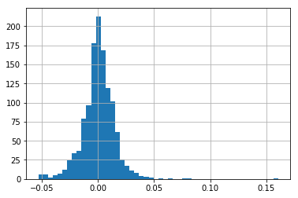


```python
amazon['daily returns'].hist(bins=50)
```


    <matplotlib.axes._subplots.AxesSubplot at 0x7ff475715da0>


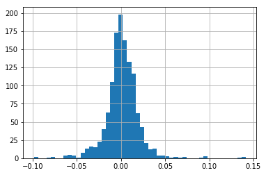


```python
apple['daily returns'].hist(bins=50)
```


    <matplotlib.axes._subplots.AxesSubplot at 0x7ff475e0bba8>


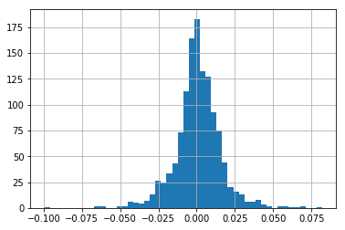


```python
microsoft['daily returns'].hist(bins=50)
```


    <matplotlib.axes._subplots.AxesSubplot at 0x7ff47507fba8>


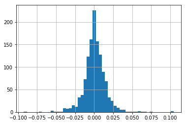


```python
walmart['daily returns'].hist(bins=50)
```


    <matplotlib.axes._subplots.AxesSubplot at 0x7ff47500b0b8>


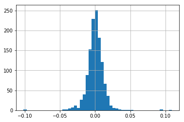


```python
google['daily returns'].hist(bins=100, label="Google", figsize=(10,8), alpha=0.5)
amazon['daily returns'].hist(bins=100, label="Amazon", alpha=0.5)
apple['daily returns'].hist(bins=100, label="Apple", alpha=0.5)
microsoft['daily returns'].hist(bins=100, label="Microsoft", alpha=0.5)
walmart['daily returns'].hist(bins=100, label="Walmart", alpha=0.5)
plt.legend()
```


    <matplotlib.legend.Legend at 0x7ff4750d1f28>


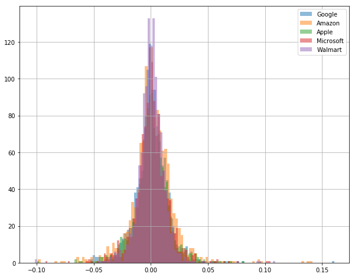


```python
# Kernel Density Estimate
google['daily returns'].plot(kind='kde', label="Google", figsize=(12,6))
apple['daily returns'].plot(kind='kde', label="Apple")
amazon['daily returns'].plot(kind='kde', label="Amazon")
microsoft['daily returns'].plot(kind='kde', label="Microsoft")
walmart['daily returns'].plot(kind='kde', label="Walmart")
plt.legend()
```


    <matplotlib.legend.Legend at 0x7ff474c64780>


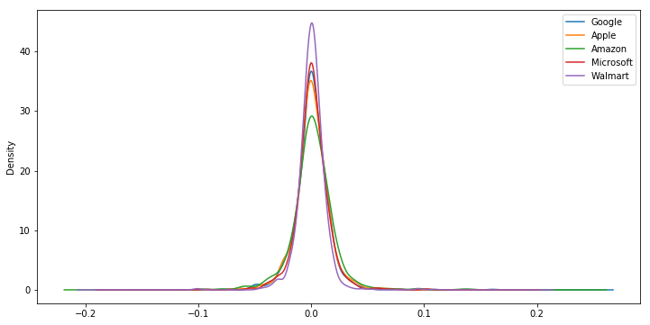


### Box plots


```python
box_plots = pd.concat([google['daily returns'], apple['daily returns'], amazon['daily returns'], microsoft['daily returns'], walmart['daily returns']], axis=1)
box_plots.columns = ["Google","Apple","Amazon","Microsoft", "Walmart"]
box_plots.plot(kind='box', figsize=(8,10), colormap="jet")
```


    <matplotlib.axes._subplots.AxesSubplot at 0x7ff4686663c8>


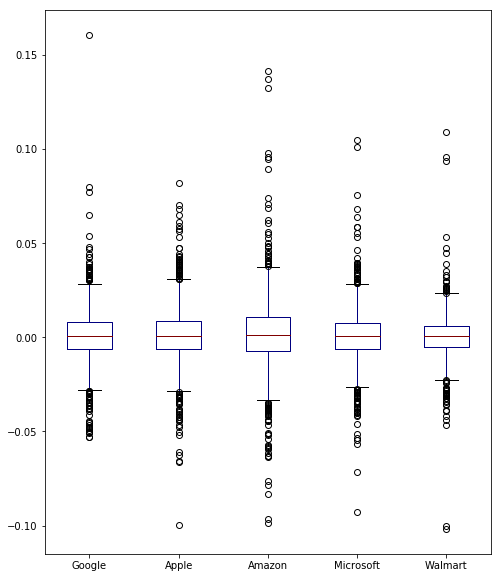


## Comparison of daily returns between stocks


```python
scatter_matrix(box_plots, figsize=(10,10), alpha=0.2, hist_kwds={'bins':50})
plt.show()
```


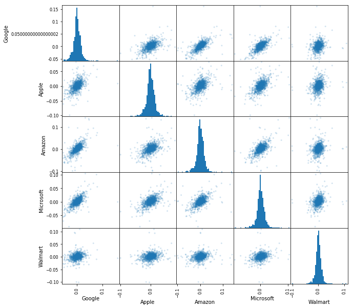


Seems like all of these companies do have some possible relationship/correlation. We could plot each pair in scatter plot to see closer. For example Microsoft and Amazon


```python
box_plots.plot(kind='scatter', x="Microsoft", y="Walmart", alpha=0.4, figsize=(10,8))
```


    <matplotlib.axes._subplots.AxesSubplot at 0x7ff468158ef0>


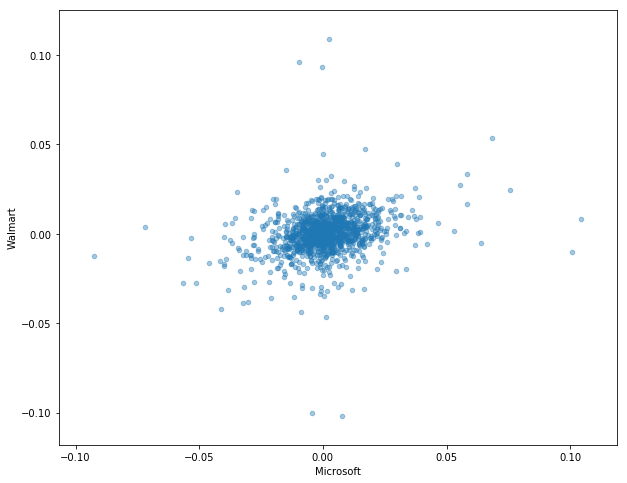


## Cumulative return

The formula for a cumulative daily return is:

$ i_i = (1+r_t) * i_{t-1} $

df[daily_cumulative_return] = ( 1 + df[pct_daily_return] ).cumprod()


```python
google['daily comulative return'] = (1+ google['daily returns']).cumprod()
amazon['daily comulative return'] = (1+ amazon['daily returns']).cumprod()
apple['daily comulative return'] = (1+ apple['daily returns']).cumprod()
microsoft['daily comulative return'] = (1+ microsoft['daily returns']).cumprod()
walmart['daily comulative return'] = (1+ walmart['daily returns']).cumprod()
```


```python
google['daily comulative return'].plot(label="Google", figsize=(16,8), title="Cumulative Return")
amazon['daily comulative return'].plot(label="Amazon")
apple['daily comulative return'].plot(label="Apple")
microsoft['daily comulative return'].plot(label="Microsoft")
walmart['daily comulative return'].plot(label="Walmart")
plt.legend()
```


    <matplotlib.legend.Legend at 0x7ff467d46470>


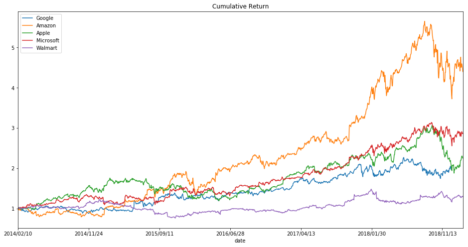


# Portfolio


```python
portfolio = pd.concat([google['close'],apple['close'], amazon['close'],microsoft['close'], walmart['close']], axis=1)
portfolio.columns = ["Google","Apple","Amazon","Microsoft", 'Walmart']
portfolio.head()
```


<div>
<style scoped>
    .dataframe tbody tr th:only-of-type {
        vertical-align: middle;
    }

    .dataframe tbody tr th {
        vertical-align: top;
    }

    .dataframe thead th {
        text-align: right;
    }
</style>
<table border="1" class="dataframe">
  <thead>
    <tr style="text-align: right;">
      <th></th>
      <th>Google</th>
      <th>Apple</th>
      <th>Amazon</th>
      <th>Microsoft</th>
      <th>Walmart</th>
    </tr>
  </thead>
  <tbody>
    <tr>
      <th>2014/02/10</th>
      <td>NaN</td>
      <td>75.5700</td>
      <td>360.87</td>
      <td>36.800</td>
      <td>73.76</td>
    </tr>
    <tr>
      <th>2014/02/11</th>
      <td>NaN</td>
      <td>76.5657</td>
      <td>361.79</td>
      <td>37.175</td>
      <td>74.80</td>
    </tr>
    <tr>
      <th>2014/02/12</th>
      <td>NaN</td>
      <td>76.5600</td>
      <td>349.25</td>
      <td>37.470</td>
      <td>74.96</td>
    </tr>
    <tr>
      <th>2014/02/13</th>
      <td>NaN</td>
      <td>77.7757</td>
      <td>357.20</td>
      <td>37.610</td>
      <td>75.36</td>
    </tr>
    <tr>
      <th>2014/02/14</th>
      <td>NaN</td>
      <td>77.7128</td>
      <td>357.35</td>
      <td>37.620</td>
      <td>75.79</td>
    </tr>
  </tbody>
</table>
</div>


```python
portfolio['Google'] = portfolio['Google'].fillna(value=portfolio['Google'].mean())
```

### Average daily return


```python
avg_daily_return = portfolio.pct_change(1).mean()
avg_daily_return
```


    Google       0.000400
    Apple        0.000765
    Amazon       0.001366
    Microsoft    0.000946
    Walmart      0.000281
    dtype: float64


**daily return correlation**


```python
portfolio.pct_change(1).corr()
```


<div>
<style scoped>
    .dataframe tbody tr th:only-of-type {
        vertical-align: middle;
    }

    .dataframe tbody tr th {
        vertical-align: top;
    }

    .dataframe thead th {
        text-align: right;
    }
</style>
<table border="1" class="dataframe">
  <thead>
    <tr style="text-align: right;">
      <th></th>
      <th>Google</th>
      <th>Apple</th>
      <th>Amazon</th>
      <th>Microsoft</th>
      <th>Walmart</th>
    </tr>
  </thead>
  <tbody>
    <tr>
      <th>Google</th>
      <td>1.000000</td>
      <td>0.433011</td>
      <td>0.563951</td>
      <td>0.568817</td>
      <td>0.187384</td>
    </tr>
    <tr>
      <th>Apple</th>
      <td>0.433011</td>
      <td>1.000000</td>
      <td>0.455844</td>
      <td>0.542195</td>
      <td>0.240550</td>
    </tr>
    <tr>
      <th>Amazon</th>
      <td>0.563951</td>
      <td>0.455844</td>
      <td>1.000000</td>
      <td>0.560731</td>
      <td>0.179514</td>
    </tr>
    <tr>
      <th>Microsoft</th>
      <td>0.568817</td>
      <td>0.542195</td>
      <td>0.560731</td>
      <td>1.000000</td>
      <td>0.270789</td>
    </tr>
    <tr>
      <th>Walmart</th>
      <td>0.187384</td>
      <td>0.240550</td>
      <td>0.179514</td>
      <td>0.270789</td>
      <td>1.000000</td>
    </tr>
  </tbody>
</table>
</div>


**Normalization**


```python
portfolio_norm = portfolio/portfolio.iloc[0]
portfolio_norm.plot(figsize=(10,6))
```


    <matplotlib.axes._subplots.AxesSubplot at 0x7ff467d89390>


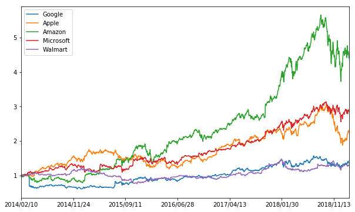


```python
portfolio_daily_return = portfolio.pct_change(1)
portfolio_daily_return.head()
```


<div>
<style scoped>
    .dataframe tbody tr th:only-of-type {
        vertical-align: middle;
    }

    .dataframe tbody tr th {
        vertical-align: top;
    }

    .dataframe thead th {
        text-align: right;
    }
</style>
<table border="1" class="dataframe">
  <thead>
    <tr style="text-align: right;">
      <th></th>
      <th>Google</th>
      <th>Apple</th>
      <th>Amazon</th>
      <th>Microsoft</th>
      <th>Walmart</th>
    </tr>
  </thead>
  <tbody>
    <tr>
      <th>2014/02/10</th>
      <td>NaN</td>
      <td>NaN</td>
      <td>NaN</td>
      <td>NaN</td>
      <td>NaN</td>
    </tr>
    <tr>
      <th>2014/02/11</th>
      <td>0.0</td>
      <td>0.013176</td>
      <td>0.002549</td>
      <td>0.010190</td>
      <td>0.014100</td>
    </tr>
    <tr>
      <th>2014/02/12</th>
      <td>0.0</td>
      <td>-0.000074</td>
      <td>-0.034661</td>
      <td>0.007935</td>
      <td>0.002139</td>
    </tr>
    <tr>
      <th>2014/02/13</th>
      <td>0.0</td>
      <td>0.015879</td>
      <td>0.022763</td>
      <td>0.003736</td>
      <td>0.005336</td>
    </tr>
    <tr>
      <th>2014/02/14</th>
      <td>0.0</td>
      <td>-0.000809</td>
      <td>0.000420</td>
      <td>0.000266</td>
      <td>0.005706</td>
    </tr>
  </tbody>
</table>
</div>


### Log Returns


```python
log_return = np.log(portfolio/portfolio.shift(1))
log_return.tail()
```


<div>
<style scoped>
    .dataframe tbody tr th:only-of-type {
        vertical-align: middle;
    }

    .dataframe tbody tr th {
        vertical-align: top;
    }

    .dataframe thead th {
        text-align: right;
    }
</style>
<table border="1" class="dataframe">
  <thead>
    <tr style="text-align: right;">
      <th></th>
      <th>Google</th>
      <th>Apple</th>
      <th>Amazon</th>
      <th>Microsoft</th>
      <th>Walmart</th>
    </tr>
  </thead>
  <tbody>
    <tr>
      <th>2019/02/04</th>
      <td>0.019657</td>
      <td>0.028009</td>
      <td>0.004344</td>
      <td>0.028392</td>
      <td>0.009649</td>
    </tr>
    <tr>
      <th>2019/02/05</th>
      <td>0.011576</td>
      <td>0.016965</td>
      <td>0.015492</td>
      <td>0.013900</td>
      <td>0.008720</td>
    </tr>
    <tr>
      <th>2019/02/06</th>
      <td>-0.027208</td>
      <td>0.000344</td>
      <td>-0.011246</td>
      <td>-0.011161</td>
      <td>0.000418</td>
    </tr>
    <tr>
      <th>2019/02/07</th>
      <td>-0.014924</td>
      <td>-0.019121</td>
      <td>-0.015910</td>
      <td>-0.007194</td>
      <td>0.011332</td>
    </tr>
    <tr>
      <th>2019/02/08</th>
      <td>-0.003328</td>
      <td>-0.003105</td>
      <td>-0.016331</td>
      <td>0.003793</td>
      <td>-0.011960</td>
    </tr>
  </tbody>
</table>
</div>


```python
log_return.hist(bins=100, figsize=(12,8))
plt.tight_layout()
```


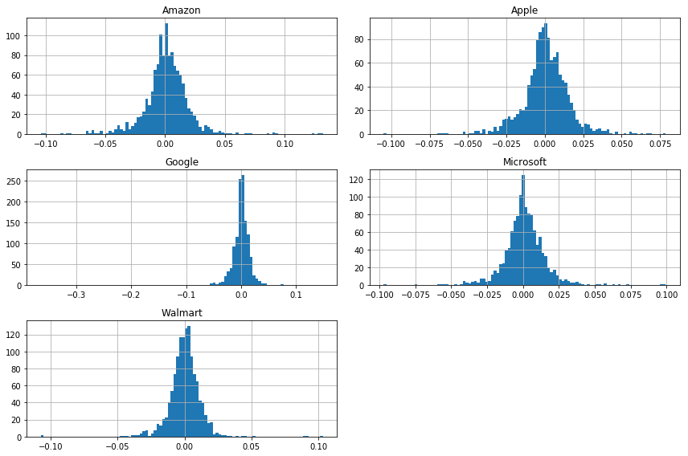


```python
log_return.describe().transpose()
```


<div>
<style scoped>
    .dataframe tbody tr th:only-of-type {
        vertical-align: middle;
    }

    .dataframe tbody tr th {
        vertical-align: top;
    }

    .dataframe thead th {
        text-align: right;
    }
</style>
<table border="1" class="dataframe">
  <thead>
    <tr style="text-align: right;">
      <th></th>
      <th>count</th>
      <th>mean</th>
      <th>std</th>
      <th>min</th>
      <th>25%</th>
      <th>50%</th>
      <th>75%</th>
      <th>max</th>
    </tr>
  </thead>
  <tbody>
    <tr>
      <th>Google</th>
      <td>1258.0</td>
      <td>0.000245</td>
      <td>0.017887</td>
      <td>-0.364604</td>
      <td>-0.006009</td>
      <td>0.000130</td>
      <td>0.008088</td>
      <td>0.148872</td>
    </tr>
    <tr>
      <th>Apple</th>
      <td>1258.0</td>
      <td>0.000646</td>
      <td>0.015374</td>
      <td>-0.104924</td>
      <td>-0.006316</td>
      <td>0.000518</td>
      <td>0.008539</td>
      <td>0.078794</td>
    </tr>
    <tr>
      <th>Amazon</th>
      <td>1258.0</td>
      <td>0.001178</td>
      <td>0.019322</td>
      <td>-0.104060</td>
      <td>-0.007083</td>
      <td>0.001293</td>
      <td>0.010696</td>
      <td>0.132178</td>
    </tr>
    <tr>
      <th>Microsoft</th>
      <td>1258.0</td>
      <td>0.000838</td>
      <td>0.014618</td>
      <td>-0.097099</td>
      <td>-0.006044</td>
      <td>0.000535</td>
      <td>0.007800</td>
      <td>0.099413</td>
    </tr>
    <tr>
      <th>Walmart</th>
      <td>1258.0</td>
      <td>0.000206</td>
      <td>0.012261</td>
      <td>-0.107399</td>
      <td>-0.005351</td>
      <td>0.000413</td>
      <td>0.006173</td>
      <td>0.103444</td>
    </tr>
  </tbody>
</table>
</div>


```python
# Yearly average return
log_return.mean()*252
```


    Google       0.061854
    Apple        0.162888
    Amazon       0.296841
    Microsoft    0.211300
    Walmart      0.051912
    dtype: float64


```python
# Compute covariance
log_return.cov()
```


<div>
<style scoped>
    .dataframe tbody tr th:only-of-type {
        vertical-align: middle;
    }

    .dataframe tbody tr th {
        vertical-align: top;
    }

    .dataframe thead th {
        text-align: right;
    }
</style>
<table border="1" class="dataframe">
  <thead>
    <tr style="text-align: right;">
      <th></th>
      <th>Google</th>
      <th>Apple</th>
      <th>Amazon</th>
      <th>Microsoft</th>
      <th>Walmart</th>
    </tr>
  </thead>
  <tbody>
    <tr>
      <th>Google</th>
      <td>0.000320</td>
      <td>0.000114</td>
      <td>0.000187</td>
      <td>0.000143</td>
      <td>0.000039</td>
    </tr>
    <tr>
      <th>Apple</th>
      <td>0.000114</td>
      <td>0.000236</td>
      <td>0.000136</td>
      <td>0.000122</td>
      <td>0.000045</td>
    </tr>
    <tr>
      <th>Amazon</th>
      <td>0.000187</td>
      <td>0.000136</td>
      <td>0.000373</td>
      <td>0.000158</td>
      <td>0.000043</td>
    </tr>
    <tr>
      <th>Microsoft</th>
      <td>0.000143</td>
      <td>0.000122</td>
      <td>0.000158</td>
      <td>0.000214</td>
      <td>0.000049</td>
    </tr>
    <tr>
      <th>Walmart</th>
      <td>0.000039</td>
      <td>0.000045</td>
      <td>0.000043</td>
      <td>0.000049</td>
      <td>0.000150</td>
    </tr>
  </tbody>
</table>
</div>


```python
# Yearly covariance
log_return.cov()*252
```


<div>
<style scoped>
    .dataframe tbody tr th:only-of-type {
        vertical-align: middle;
    }

    .dataframe tbody tr th {
        vertical-align: top;
    }

    .dataframe thead th {
        text-align: right;
    }
</style>
<table border="1" class="dataframe">
  <thead>
    <tr style="text-align: right;">
      <th></th>
      <th>Google</th>
      <th>Apple</th>
      <th>Amazon</th>
      <th>Microsoft</th>
      <th>Walmart</th>
    </tr>
  </thead>
  <tbody>
    <tr>
      <th>Google</th>
      <td>0.080630</td>
      <td>0.028713</td>
      <td>0.047030</td>
      <td>0.035947</td>
      <td>0.009934</td>
    </tr>
    <tr>
      <th>Apple</th>
      <td>0.028713</td>
      <td>0.059564</td>
      <td>0.034250</td>
      <td>0.030809</td>
      <td>0.011424</td>
    </tr>
    <tr>
      <th>Amazon</th>
      <td>0.047030</td>
      <td>0.034250</td>
      <td>0.094081</td>
      <td>0.039746</td>
      <td>0.010807</td>
    </tr>
    <tr>
      <th>Microsoft</th>
      <td>0.035947</td>
      <td>0.030809</td>
      <td>0.039746</td>
      <td>0.053849</td>
      <td>0.012271</td>
    </tr>
    <tr>
      <th>Walmart</th>
      <td>0.009934</td>
      <td>0.011424</td>
      <td>0.010807</td>
      <td>0.012271</td>
      <td>0.037884</td>
    </tr>
  </tbody>
</table>
</div>


### Single run for a random allocation


```python
np.random.seed(101)

# Stocks in portfolio
print("Stock in portfolio")
print(portfolio.columns)
print()

# Generate random weights
weights = np.array(np.random.random(len(portfolio.columns)))
print("Random weights:")
print(weights)
print()


# Rebalance the weights
weights = weights/np.sum(weights)
print("Balanced weights:")
print(weights)
print()

# Expected return
exp_return = np.sum(log_return.mean()*weights)*252
print("Expected Return of this combination:")
print(exp_return)
print()

# Expected variance
exp_vol = np.sqrt(np.dot(weights.T, np.dot(log_return.cov()*252, weights)))
print("Expected volatility")
print(exp_vol)
print()

# Sharpe Ratio
sharpe = exp_return/exp_vol
print("Sharpe Ratio")
print(sharpe)
```

    Stock in portfolio
    Index(['Google', 'Apple', 'Amazon', 'Microsoft', 'Walmart'], dtype='object')
    
    Random weights:
    [0.51639863 0.57066759 0.02847423 0.17152166 0.68527698]
    
    Balanced weights:
    [0.26182041 0.28933544 0.01443678 0.08696357 0.3474438 ]
    
    Expected Return of this combination:
    0.104021143212784
    
    Expected volatility
    0.16954839904081034
    
    Sharpe Ratio
    0.6135188760334215


### Run simulations to find the best portfolio
**run 15000 simulations**


```python
num_port = 15000
all_weights = np.zeros((num_port, len(portfolio.columns)))
return_arr = np.zeros(num_port)
vol_arr = np.zeros(num_port)
sharpe_arr = np.zeros(num_port)

for i in range(num_port):
    #Create random weights
    weights = np.array(np.random.random(len(portfolio.columns)))
    # Rebalance weights
    weights = weights/np.sum(weights)
    
    # Fill the weights in to weight array
    all_weights[i,:] = weights
    
    # Expected return
    return_arr[i] = np.sum((log_return.mean()*weights)*252)
    
    # Expected variance
    vol_arr[i] = np.sqrt(np.dot(weights.T, np.dot(log_return.cov()*252, weights)))
    
    # Sharpe Ratio
    sharpe_arr[i] = return_arr[i]/vol_arr[i]
```


```python
sharpe_arr.max()
```


    1.0643946907353037


```python
best = sharpe_arr.argmax()
best
```


    13123


```python
print(portfolio.columns)
all_weights[best, :]
```

    Index(['Google', 'Apple', 'Amazon', 'Microsoft', 'Walmart'], dtype='object')


    array([0.0025217 , 0.08609686, 0.41891077, 0.41318238, 0.07928828])


```python
max_sr_return = return_arr[best]
max_sr_vol = vol_arr[best]
print(max_sr_return)
print(max_sr_vol)
```

    0.22995166524173952
    0.21603984616165703


### Plot the data


```python
plt.figure(figsize = (12,8))
plt.scatter(vol_arr, return_arr, c=sharpe_arr, cmap='plasma')
plt.colorbar(label="Sharpe Ratio")
plt.xlabel("Volatility")
plt.ylabel("Return")

# Add red dot for at the max sharpe ratio
plt.scatter(max_sr_vol, max_sr_return, c='red', s=50, edgecolors='black')
```


    <matplotlib.collections.PathCollection at 0x7ff468072358>


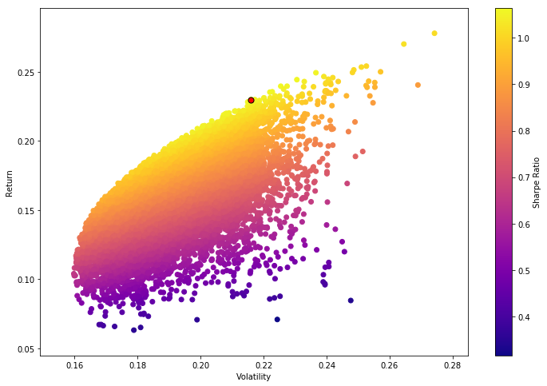


```python

```


```python

```


```python

```


```python

```
