```python
import pandas as pd
import matplotlib.pyplot as plt
import matplotlib
import scipy
import numpy as np
%matplotlib inline
```


```python
train_df = pd.read_csv('./titanic_data/train.csv')
```


```python
train_df.shape
```


    (891, 12)


```python
train_df.count()
```


    PassengerId    891
    Survived       891
    Pclass         891
    Name           891
    Sex            891
    Age            714
    SibSp          891
    Parch          891
    Ticket         891
    Fare           891
    Cabin          204
    Embarked       889
    dtype: int64


```python
train_df.head()
```


<div>
<style scoped>
    .dataframe tbody tr th:only-of-type {
        vertical-align: middle;
    }

    .dataframe tbody tr th {
        vertical-align: top;
    }

    .dataframe thead th {
        text-align: right;
    }
</style>
<table border="1" class="dataframe">
  <thead>
    <tr style="text-align: right;">
      <th></th>
      <th>PassengerId</th>
      <th>Survived</th>
      <th>Pclass</th>
      <th>Name</th>
      <th>Sex</th>
      <th>Age</th>
      <th>SibSp</th>
      <th>Parch</th>
      <th>Ticket</th>
      <th>Fare</th>
      <th>Cabin</th>
      <th>Embarked</th>
    </tr>
  </thead>
  <tbody>
    <tr>
      <th>0</th>
      <td>1</td>
      <td>0</td>
      <td>3</td>
      <td>Braund, Mr. Owen Harris</td>
      <td>male</td>
      <td>22.0</td>
      <td>1</td>
      <td>0</td>
      <td>A/5 21171</td>
      <td>7.2500</td>
      <td>NaN</td>
      <td>S</td>
    </tr>
    <tr>
      <th>1</th>
      <td>2</td>
      <td>1</td>
      <td>1</td>
      <td>Cumings, Mrs. John Bradley (Florence Briggs Th...</td>
      <td>female</td>
      <td>38.0</td>
      <td>1</td>
      <td>0</td>
      <td>PC 17599</td>
      <td>71.2833</td>
      <td>C85</td>
      <td>C</td>
    </tr>
    <tr>
      <th>2</th>
      <td>3</td>
      <td>1</td>
      <td>3</td>
      <td>Heikkinen, Miss. Laina</td>
      <td>female</td>
      <td>26.0</td>
      <td>0</td>
      <td>0</td>
      <td>STON/O2. 3101282</td>
      <td>7.9250</td>
      <td>NaN</td>
      <td>S</td>
    </tr>
    <tr>
      <th>3</th>
      <td>4</td>
      <td>1</td>
      <td>1</td>
      <td>Futrelle, Mrs. Jacques Heath (Lily May Peel)</td>
      <td>female</td>
      <td>35.0</td>
      <td>1</td>
      <td>0</td>
      <td>113803</td>
      <td>53.1000</td>
      <td>C123</td>
      <td>S</td>
    </tr>
    <tr>
      <th>4</th>
      <td>5</td>
      <td>0</td>
      <td>3</td>
      <td>Allen, Mr. William Henry</td>
      <td>male</td>
      <td>35.0</td>
      <td>0</td>
      <td>0</td>
      <td>373450</td>
      <td>8.0500</td>
      <td>NaN</td>
      <td>S</td>
    </tr>
  </tbody>
</table>
</div>


```python
# get value count: 0 is dead, 1 is survived
value_count = train_df['Survived'].value_counts()
value_count
```


    0    549
    1    342
    Name: Survived, dtype: int64


```python
value_count.plot(kind='bar', alpha=0.5, title="Survived rate")
```


    <matplotlib.axes._subplots.AxesSubplot at 0x7fa3227ab3c8>


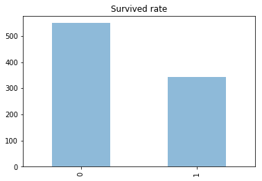


```python
value_count_norm = train_df['Survived'].value_counts(normalize=True)
value_count_norm
```


    0    0.616162
    1    0.383838
    Name: Survived, dtype: float64


```python
value_count_norm.plot(kind='bar', alpha=0.5, title="Survived rate")
```


    <matplotlib.axes._subplots.AxesSubplot at 0x7fa32072ccf8>


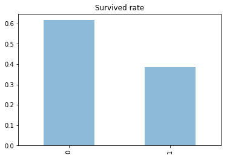


There were about 40% passengers survived, and 60% died in the accident

## Age with regard to survived


```python
plt.scatter(train_df['Survived'], train_df['Age'], alpha=0.2)
```


    <matplotlib.collections.PathCollection at 0x7fa32066fef0>


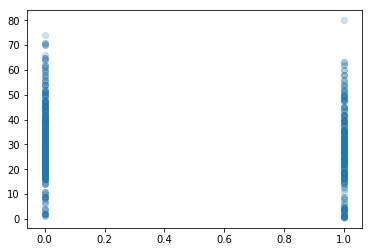


Seems like there is no links or no indications of relationship between age and possibility of surviving the accident. Even though the number of people at the age of 60 or above died seemed higher than survived, it's not clear enough to tell.

## Class with regard to survived


```python
# Total number of passenger in each class
pclass = train_df['Pclass'].value_counts(normalize=True)
pclass
```


    3    0.551066
    1    0.242424
    2    0.206510
    Name: Pclass, dtype: float64


```python
pclass.plot(kind='bar', alpha=0.5)
```


    <matplotlib.axes._subplots.AxesSubplot at 0x7fa32062acf8>


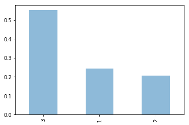


```python
for x in [1,2,3]:
    train_df['Age'][train_df['Pclass'] == x].plot(kind='kde', figsize=(10,5))
plt.title("Class with regard to Age")
plt.legend(["1st", "2nd", "3rd"])
```


    <matplotlib.legend.Legend at 0x7fa3205acac8>


From the graph we can see that a lot of young people were traveling with 3rd class tickets. Meanwhile, the number of older people traveling with 1st class tickets were much higher. It's clearly as shown in the movie that those people were in the 1st class were middle age wealthy people.

**Exercise:**
    - Make a bar graph to show number of people survived in each class

**Solution 1**


```python
first_class = train_df[train_df['Pclass'] == 1]
survived_first_class = first_class['Pclass'][first_class['Survived']==1]

second_class = train_df[train_df['Pclass'] == 2]
survived_second_class = second_class['Pclass'][second_class['Survived']==1]

third_class = train_df[train_df['Pclass'] == 3]
survived_third_class = third_class['Pclass'][third_class['Survived']==1]
```


```python
count_sur_1 = survived_first_class.count()
count_sur_2 = survived_second_class.count()
count_sur_3 = survived_third_class.count()
```


```python
classes = ["1st", "2nd", "3rd"]
y_pos = np.arange(len(classes))
numbers = [count_sur_1, count_sur_2, count_sur_3]

plt.bar(y_pos, numbers)
plt.xticks(y_pos, classes)
plt.ylabel("Survived people")

plt.show()
```


**Solution 2**


```python
sur_class = train_df['Pclass'][train_df["Survived"] == 1].value_counts()
```


```python
sur_class.plot(kind='bar', alpha=0.5)
```


    <matplotlib.axes._subplots.AxesSubplot at 0x7fa3206b4710>


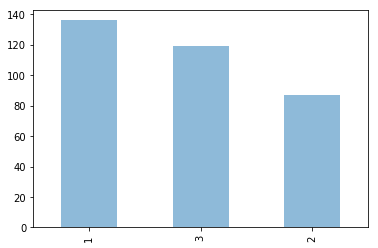


## Embarked


```python
total_embarked = train_df['Embarked'].value_counts()
total_embarked.plot(kind='bar', alpha=0.5)
```


    <matplotlib.axes._subplots.AxesSubplot at 0x7fa3182a62e8>


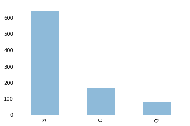


Titanic stopped at three location:
- Southhampton
- Cherbourg, France
- Queenstown, Ireland

So more than 70% of passengers started the journey from Southhampton, England

**Quick Exercise:**
    - Make a bar graph to show number of people survived according the embarked locations

**Solution**


```python
sur_emb = train_df['Embarked'][train_df["Survived"] == 1].value_counts()
sur_emb.plot(kind='bar', alpha=0.5)
```


    <matplotlib.axes._subplots.AxesSubplot at 0x7fa318276fd0>


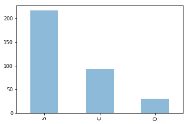


## Genders


```python
men = train_df['Survived'][train_df['Sex'] == 'male'].value_counts(normalize=True)
men.plot(kind='bar', alpha=0.5)
```


    <matplotlib.axes._subplots.AxesSubplot at 0x7fa3182a6518>


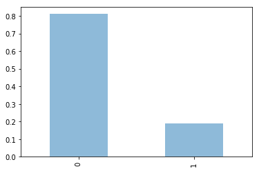


```python
women = train_df['Survived'][train_df['Sex'] == 'female'].value_counts(normalize=True)
women.plot(kind='bar', color = 'pink')
```


    <matplotlib.axes._subplots.AxesSubplot at 0x7fa3181e3e10>


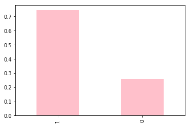


```python
total_sur_sex = train_df['Sex'][train_df['Survived'] == 1].value_counts(normalize=True)
total_sur_sex.plot(kind='bar', color=['pink','b'])
```


    <matplotlib.axes._subplots.AxesSubplot at 0x7fa3181cb6a0>


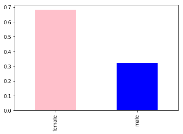


Even though this dataset is not completed, but it's still a good indication. As shown in the movie, when the ship was shinking, women and children were given priority to leave first.

### Rich men and Poor men


```python
rich_men = train_df['Survived'][(train_df['Sex'] == 'male') & (train_df['Pclass'] == 1)].value_counts(normalize=True)
rich_men.plot(kind='bar')
plt.title("Rich men survived")
```


    Text(0.5, 1.0, 'Rich men survived')


```python
poor_men = train_df['Survived'][(train_df['Sex'] == 'male') & (train_df['Pclass'] == 3)].value_counts(normalize=True)
poor_men.plot(kind='bar')
plt.title("Poor men survived")
```


    Text(0.5, 1.0, 'Poor men survived')


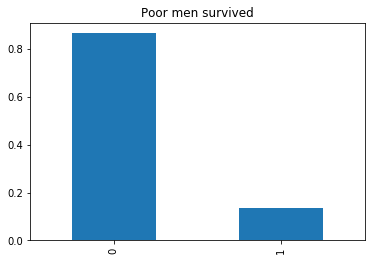


```python
rich_women = train_df['Survived'][(train_df['Sex'] == 'female') & (train_df['Pclass'] == 1)].value_counts(normalize=True)
rich_women.plot(kind='bar', color='pink')
plt.title("Rich women survived")
```


    Text(0.5, 1.0, 'Rich women survived')


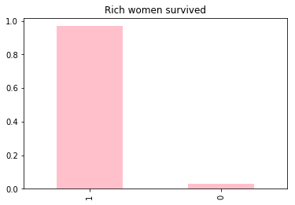


```python
poor_women = train_df['Survived'][(train_df['Sex'] == 'female') & (train_df['Pclass'] == 3)].value_counts(normalize=True)
poor_women.plot(kind='bar', color='pink')
plt.title("Poor women survived")
```


    Text(0.5, 1.0, 'Poor women survived')


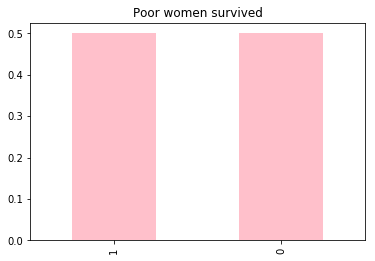


### Other methods


```python
def plot_bar_chart(feature):
    survived = train_df[train_df['Survived']==1][feature].value_counts()
    dead = train_df[train_df["Survived"]==0][feature].value_counts()
    df = pd.DataFrame([survived, dead])
    df.index = ['Survived', 'Dead']
    df.plot(kind='bar', stacked=True, figsize=(10,5))
```


```python
plot_bar_chart("Sex")
```


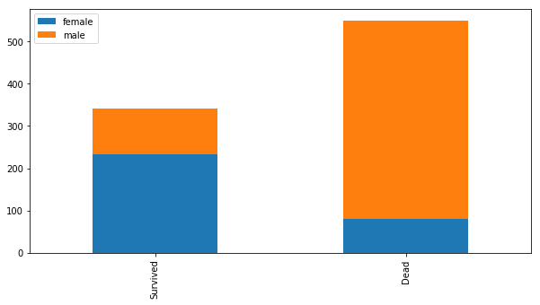


```python
plot_bar_chart("Pclass")
```


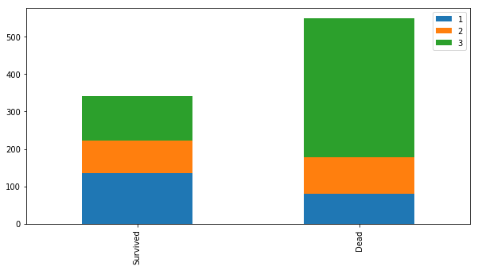


```python
plot_bar_chart('SibSp')
```


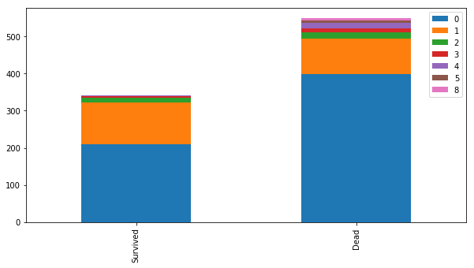


```python
plot_bar_chart('Parch')
```


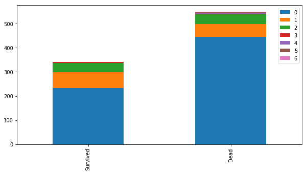


```python
plot_bar_chart('Embarked')
```


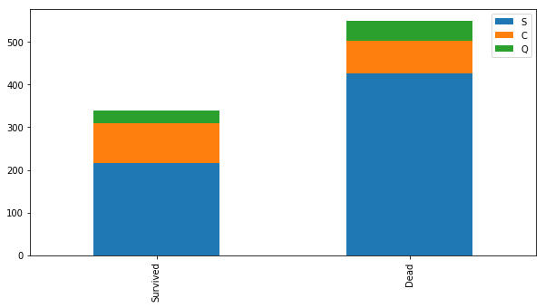


```python

```
