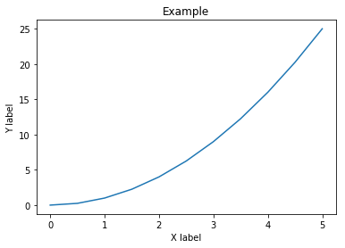
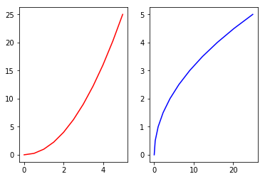
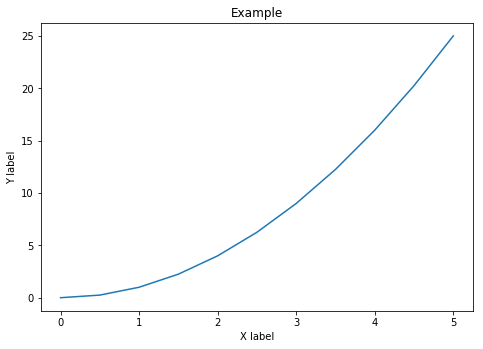
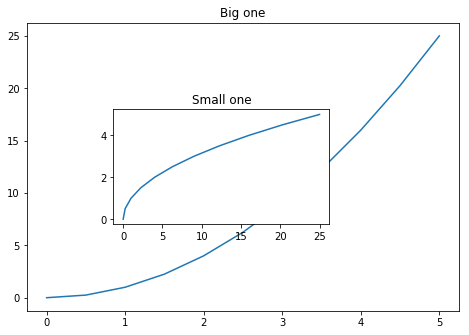

[Matplotlib Documentation](https://matplotlib.org/)


```python
import matplotlib.pyplot as plt
%matplotlib inline
```


```python
import numpy as np
x = np.linspace(0, 5, 11)
y = x ** 2
```


```python
x
```


    array([0. , 0.5, 1. , 1.5, 2. , 2.5, 3. , 3.5, 4. , 4.5, 5. ])


```python
y
```


    array([ 0.  ,  0.25,  1.  ,  2.25,  4.  ,  6.25,  9.  , 12.25, 16.  ,
           20.25, 25.  ])


```python
# Functional method
plt.plot(x, y)
plt.xlabel('X label')
plt.ylabel('Y label')
plt.title("Example")
plt.show()
# must run plt.show() if you're not in jupyter notebook
```





```python
# Multi plot in the same canvas
# row, column, slot
plt.subplot(1,2,1)
plt.plot(x,y,'r')

plt.subplot(1,2,2)
plt.plot(y,x,'b')
plt.show()
```





```python
# OOP method
fig = plt.figure()

# Place the axes and set the fig as large as the canvas
axes = fig.add_axes([0,0,1,1])
axes.plot(x, y)
axes.set_xlabel('X label')
axes.set_ylabel('Y label')
axes.set_title('Example')
```


    Text(0.5, 1.0, 'Example')





```python
fig = plt.figure()
# the first axes will be as big as the canvas
axes_1 = fig.add_axes([0,0,1,1])
# the second axes will be 20% off x0, 30% off y0, 50% width, 40% heigh 
axes_2 = fig.add_axes([0.2, 0.3, 0.5, 0.4])

axes_1.plot(x,y)
axes_2.plot(y,x)

axes_1.set_title("Big one")

axes_2.set_title("Small one")
```


    Text(0.5, 1.0, 'Small one')





**We can add color, line weight, line style to the figure as well by adding parameters/arguments to the plot()**
- color: to change line color
- lw: the thickness of the line
- ls: line style, --, or .-.-, and so on
- marker: add marker
- markersize: size of the marker
- markerfacecolor: marker color
- Check matplotlib documentation for more 


```python

```
