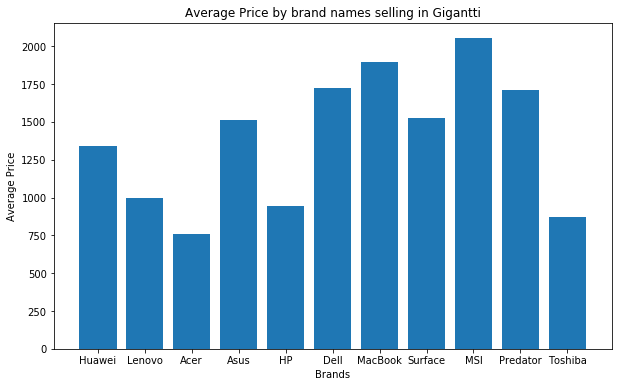
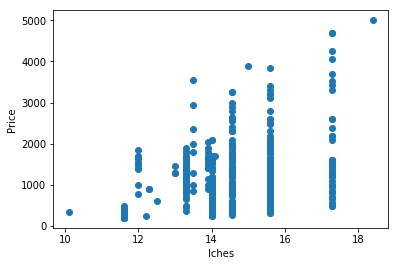

```python
import pandas as pd
import numpy as np
import matplotlib.pyplot as plt
%matplotlib inline
```


```python
df = pd.read_csv('glap.csv')
```


```python
df.tail()
```


<div>
<style scoped>
    .dataframe tbody tr th:only-of-type {
        vertical-align: middle;
    }

    .dataframe tbody tr th {
        vertical-align: top;
    }

    .dataframe thead th {
        text-align: right;
    }
</style>
<table border="1" class="dataframe">
  <thead>
    <tr style="text-align: right;">
      <th></th>
      <th>Product Name</th>
      <th>Product Number</th>
      <th>Product Price</th>
    </tr>
  </thead>
  <tbody>
    <tr>
      <th>513</th>
      <td>Dell XPS 15-9575 15.6" 2-in-1 (platinahopea)</td>
      <td>DEXPS9575410</td>
      <td>1 899</td>
    </tr>
    <tr>
      <th>514</th>
      <td>Lenovo ThinkPad T470s 14.1" kannettava (musta)</td>
      <td>LE20HF004VMX</td>
      <td>1 699Outletista alkaen 1 539€</td>
    </tr>
    <tr>
      <th>515</th>
      <td>Lenovo Yoga 730 13.3" 2-in-1 (kupari)</td>
      <td>LE81CT007VMX</td>
      <td>1 199</td>
    </tr>
    <tr>
      <th>516</th>
      <td>MSI GT75 8RG-080NE Titan Pro 17.3" pelikannettava</td>
      <td>MSIGT758RG080</td>
      <td>4 259</td>
    </tr>
    <tr>
      <th>517</th>
      <td>Surface Book i5 13.5" 128 GB</td>
      <td>MSSBI58128</td>
      <td>1 299Outletista alkaen 1 140€</td>
    </tr>
  </tbody>
</table>
</div>


```python
# Clean up price
# Separate brand names
# Make a graph by product names and prices
# Average price
# New column for the size of laptops
```

### Convert the Price to Interger
**Problems:**
    - Prices are in unicode format, they need to be encoded and then convert to integer
    - Some data rows are long strings with texts
    - Texts need to be ommited
    - If there are prices in the beginning of the text ```example: 1234Outletisa...```, extract the price by split the string at ```"Outlet"```.
    - There is at least one row does not have price in the beginning,but only in the end, this string need to be split at ```" "``` and take the last element as the price. However, it need to be split again at ``` "'" ``` to ommit the single quotation mark, and take the first element


```python
df = df[df['Product Price'] != '19']
```


```python
df = df.reset_index(drop=True)
for i in range(0, len(df['Product Price'])):
    df['Product Price'][i] = df['Product Price'][i].encode('ascii', 'ignore')
```


```python
for i in range(0, len(df['Product Price'])):
    try:
        df['Product Price'][i] = int(df['Product Price'][i])
    except ValueError:
        string = str(df['Product Price'][i])
        split_string_list = string.split("Outlet")
        # There was one empty string that we cannot convert into int(), in row 234 in csv file
        # Because it does not have a price in the beginning of the string
        # There for we have to take the price in the end of the string
        try:
            df['Product Price'][i] = int(split_string_list[0].split("'")[-1])
        except ValueError:
            df['Product Price'][i] = int(string.split(" ")[-1].split("'")[0])
```


```python
avg = df['Product Price'].mean()
min_price = df['Product Price'].min()
max_price = df['Product Price'].max()

print("The average price of laptops in Giganti store is {}".format(avg))
print("The lowest price of laptops in Giganti store is {} Euros".format(min_price))
print("The highest price of laptops in Giganti store is {} Euros".format(max_price))

```

    The average price of laptops in Giganti store is 1184.5387596899225
    The lowest price of laptops in Giganti store is 199 Euros
    The highest price of laptops in Giganti store is 4999 Euros


```python
df[df['Product Price'] == max_price]
```


<div>
<style scoped>
    .dataframe tbody tr th:only-of-type {
        vertical-align: middle;
    }

    .dataframe tbody tr th {
        vertical-align: top;
    }

    .dataframe thead th {
        text-align: right;
    }
</style>
<table border="1" class="dataframe">
  <thead>
    <tr style="text-align: right;">
      <th></th>
      <th>Product Name</th>
      <th>Product Number</th>
      <th>Product Price</th>
    </tr>
  </thead>
  <tbody>
    <tr>
      <th>373</th>
      <td>MSI GT83VR 7RF-216NE Titan 18.4" pelikannettava</td>
      <td>MSIGT837RF216</td>
      <td>4999</td>
    </tr>
  </tbody>
</table>
</div>


```python
df[df['Product Price'] == min_price]
```


<div>
<style scoped>
    .dataframe tbody tr th:only-of-type {
        vertical-align: middle;
    }

    .dataframe tbody tr th {
        vertical-align: top;
    }

    .dataframe thead th {
        text-align: right;
    }
</style>
<table border="1" class="dataframe">
  <thead>
    <tr style="text-align: right;">
      <th></th>
      <th>Product Name</th>
      <th>Product Number</th>
      <th>Product Price</th>
    </tr>
  </thead>
  <tbody>
    <tr>
      <th>3</th>
      <td>Asus Chromebook C223NA 11.6" kannettava (harmaa)</td>
      <td>ASC223NGJ0002</td>
      <td>199</td>
    </tr>
    <tr>
      <th>10</th>
      <td>Asus Chromebook C223NA 11.6" kannettava (harmaa)</td>
      <td>ASC223NGJ0002</td>
      <td>199</td>
    </tr>
    <tr>
      <th>13</th>
      <td>Asus Chromebook C223NA 11.6" kannettava (harmaa)</td>
      <td>ASC223NGJ0002</td>
      <td>199</td>
    </tr>
    <tr>
      <th>22</th>
      <td>Lenovo Ideapad 120s 11.6" kannettava (harmaa)</td>
      <td>LE81A400L1MX</td>
      <td>199</td>
    </tr>
  </tbody>
</table>
</div>


**Seems like we have duplicated rows, at least from what we see here, row 3, row 10, row 13 are showing the same product**

### Separate brand names


```python
# The method I used here is called List Comprehension, you can do research on it.
df["Brand"] = [brand.split(" ")[0] for brand in df["Product Name"]]
```


```python
df.tail()
```


<div>
<style scoped>
    .dataframe tbody tr th:only-of-type {
        vertical-align: middle;
    }

    .dataframe tbody tr th {
        vertical-align: top;
    }

    .dataframe thead th {
        text-align: right;
    }
</style>
<table border="1" class="dataframe">
  <thead>
    <tr style="text-align: right;">
      <th></th>
      <th>Product Name</th>
      <th>Product Number</th>
      <th>Product Price</th>
      <th>Brand</th>
    </tr>
  </thead>
  <tbody>
    <tr>
      <th>511</th>
      <td>Dell XPS 15-9575 15.6" 2-in-1 (platinahopea)</td>
      <td>DEXPS9575410</td>
      <td>1899</td>
      <td>Dell</td>
    </tr>
    <tr>
      <th>512</th>
      <td>Lenovo ThinkPad T470s 14.1" kannettava (musta)</td>
      <td>LE20HF004VMX</td>
      <td>1699</td>
      <td>Lenovo</td>
    </tr>
    <tr>
      <th>513</th>
      <td>Lenovo Yoga 730 13.3" 2-in-1 (kupari)</td>
      <td>LE81CT007VMX</td>
      <td>1199</td>
      <td>Lenovo</td>
    </tr>
    <tr>
      <th>514</th>
      <td>MSI GT75 8RG-080NE Titan Pro 17.3" pelikannettava</td>
      <td>MSIGT758RG080</td>
      <td>4259</td>
      <td>MSI</td>
    </tr>
    <tr>
      <th>515</th>
      <td>Surface Book i5 13.5" 128 GB</td>
      <td>MSSBI58128</td>
      <td>1299</td>
      <td>Surface</td>
    </tr>
  </tbody>
</table>
</div>


### Laptop Sizes
**Problem:**
    - Laptops' sizes are in between of the laptops' names
    - In ovarall, it seems that if we split the name at white spaces, the laptops' sizes are at the forth position. But becarefull, not all of them are.
    - However, all of them are having the inches sign ("). So I'll start from there


```python

for each in df["Product Name"][299].split(" "):
    if "\"" in each:
        print(each)
```

    14"


```python
size_list = []
for i in range(0, len(df["Product Name"])):
    splited = df["Product Name"][i].split(" ")
    for each in splited:
        if "\"" in each:
            size_list.append(each)
```


```python
len(df["Product Name"]) - len(size_list)
```


    69


- Now turns out, not all the products have information about screen size
- Leave it for TODO for now

### Graphs


```python
brands = df["Brand"].unique()
```


```python
print(brands)
print()
print("There are {} unique brandss".format(len(brands)))
```

    ['Huawei' 'Lenovo' 'Acer' 'Asus' 'HP' 'Dell' 'MacBook' 'Surface' 'MSI'
     'Predator' 'Toshiba']
    
    There are 11 unique brandss


```python
average_price = []
for i in range(0, len(brands)):
    
    avg = df[df["Brand"] == brands[i]]['Product Price'].mean()
    average_price.append(avg)
```


```python
y = average_price
x = list(brands)
plt.figure(figsize=(10,6))
plt.bar(x,y)
plt.xlabel("Brands")
plt.ylabel("Average Price")
plt.title("Average Price by brand names selling in Gigantti")
```


    Text(0.5, 1.0, 'Average Price by brand names selling in Gigantti')





- Interprete the graph if you want


```python
# Sizes
# Get the inches size out of the string, if there is no size, put the whole string in
size_list = []
for i in range(0, len(df["Product Name"])):
    if "\"" in df["Product Name"][i] or "”" in df["Product Name"][i]:
        splited = df["Product Name"][i].split(" ")
        for each in splited:
            if "\"" in each or "”" in each:
                size_list.append(each)
    else:
        size_list.append(df["Product Name"][i])
```


```python
#Drop the iches sign, convert to float, if no values, convert to NaN
size_list_2 = []
for each in size_list:
    try:
        each2 = float(each.strip("\""))
    except:
        each2 = np.nan
    size_list_2.append(each2)
    
```


```python
# Add new Screen Size column to dataframe
df["Screen Size"] = size_list_2
df.head()
```


<div>
<style scoped>
    .dataframe tbody tr th:only-of-type {
        vertical-align: middle;
    }

    .dataframe tbody tr th {
        vertical-align: top;
    }

    .dataframe thead th {
        text-align: right;
    }
</style>
<table border="1" class="dataframe">
  <thead>
    <tr style="text-align: right;">
      <th></th>
      <th>Product Name</th>
      <th>Product Number</th>
      <th>Product Price</th>
      <th>Brand</th>
      <th>Screen Size</th>
    </tr>
  </thead>
  <tbody>
    <tr>
      <th>0</th>
      <td>Huawei MateBook X Pro 13.9" kannettava (hopea)</td>
      <td>HU53010DAE</td>
      <td>1399</td>
      <td>Huawei</td>
      <td>13.9</td>
    </tr>
    <tr>
      <th>1</th>
      <td>Lenovo Ideapad 330 15.6" kannettava (onyksinmu...</td>
      <td>LE81DE00KYMX</td>
      <td>389</td>
      <td>Lenovo</td>
      <td>15.6</td>
    </tr>
    <tr>
      <th>2</th>
      <td>Acer Chromebook 14 14" kannettava (sininen)</td>
      <td>ACNXGU7ED006</td>
      <td>349</td>
      <td>Acer</td>
      <td>14.0</td>
    </tr>
    <tr>
      <th>3</th>
      <td>Asus Chromebook C223NA 11.6" kannettava (harmaa)</td>
      <td>ASC223NGJ0002</td>
      <td>199</td>
      <td>Asus</td>
      <td>11.6</td>
    </tr>
    <tr>
      <th>4</th>
      <td>HP 14-cm0822no 14" kannettava (musta)</td>
      <td>HP14CM0822NO</td>
      <td>449</td>
      <td>HP</td>
      <td>14.0</td>
    </tr>
  </tbody>
</table>
</div>


```python
average_size = df["Screen Size"].mean()
biggest_size = df["Screen Size"].max()
smallest_size = df["Screen Size"].min()
print(biggest_size)
print(smallest_size)
print(average_size)
```

    18.4
    10.1
    14.567488789237666


```python
# Fill in the NaN with average screen size
df["Screen Size"]=df["Screen Size"].fillna(value = average_size)
```


```python
df.tail()
```


<div>
<style scoped>
    .dataframe tbody tr th:only-of-type {
        vertical-align: middle;
    }

    .dataframe tbody tr th {
        vertical-align: top;
    }

    .dataframe thead th {
        text-align: right;
    }
</style>
<table border="1" class="dataframe">
  <thead>
    <tr style="text-align: right;">
      <th></th>
      <th>Product Name</th>
      <th>Product Number</th>
      <th>Product Price</th>
      <th>Brand</th>
      <th>Screen Size</th>
    </tr>
  </thead>
  <tbody>
    <tr>
      <th>511</th>
      <td>Dell XPS 15-9575 15.6" 2-in-1 (platinahopea)</td>
      <td>DEXPS9575410</td>
      <td>1899</td>
      <td>Dell</td>
      <td>15.6</td>
    </tr>
    <tr>
      <th>512</th>
      <td>Lenovo ThinkPad T470s 14.1" kannettava (musta)</td>
      <td>LE20HF004VMX</td>
      <td>1699</td>
      <td>Lenovo</td>
      <td>14.1</td>
    </tr>
    <tr>
      <th>513</th>
      <td>Lenovo Yoga 730 13.3" 2-in-1 (kupari)</td>
      <td>LE81CT007VMX</td>
      <td>1199</td>
      <td>Lenovo</td>
      <td>13.3</td>
    </tr>
    <tr>
      <th>514</th>
      <td>MSI GT75 8RG-080NE Titan Pro 17.3" pelikannettava</td>
      <td>MSIGT758RG080</td>
      <td>4259</td>
      <td>MSI</td>
      <td>17.3</td>
    </tr>
    <tr>
      <th>515</th>
      <td>Surface Book i5 13.5" 128 GB</td>
      <td>MSSBI58128</td>
      <td>1299</td>
      <td>Surface</td>
      <td>13.5</td>
    </tr>
  </tbody>
</table>
</div>


```python
x = df["Screen Size"]
y = df["Product Price"]
plt.scatter( x,y)
plt.xlabel("Iches")
plt.ylabel("Price")
```


    Text(0, 0.5, 'Price')





```python
average_brand_size = []
for i in range(0, len(brands)):
    
    avg_brand = df[df["Brand"] == brands[i]]['Screen Size'].mean()
    average_brand_size.append(avg_brand)
```


```python
y = average_brand_size
x = list(brands)
plt.figure(figsize=(10,6))
plt.bar(x,y)
plt.xlabel("Brands")
plt.ylabel("Average Screen Size")
plt.title("Average Screen Size by brand name selling in Gigantti")
```


    Text(0.5, 1.0, 'Average Screen Size by brand name selling in Gigantti')


```python

```
